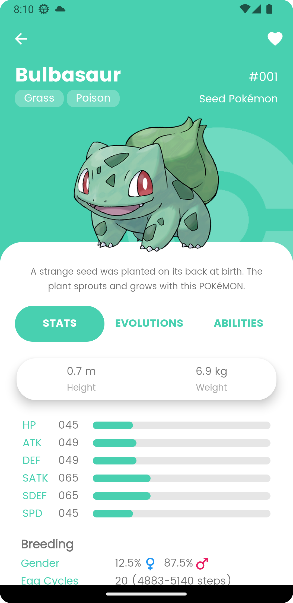

# PokeApp

This is a sample Pokemon App written in Kotlin using a modern Android Architecture

# Technology stack

- IDE: Android Studio
- API: [PokeAPI](https://pokeapi.co/)
- Architecture: Clean Architecture + MVVM & LiveData
- Programming Language: Kotlin
- Third Party Libraries: Retrofit, Room, Glide, Dagger Hilt, Gson, MockK, JUnit4, Okhttp3

# Screens

<table style="width:100%">
  <tr>
    <th>List</th>
    <th>Stats</th>
    <th>Filter</th>
  </tr>
  <tr>
    <td></td>
    <td></td>
    <td></td>
  </tr>
</table>

<table style="width:100%">
<tr>
    <th> GIF  </th>
    <th> List </th>
    <th>Filter</th>
    <th>Empty </th>
  </tr>
  <tr>
    <td></td>
    <td></td>
    <td></td>
    <td></td>
  </tr>
</table>

* David Diaz
* daviddiaz_94@hotmail.com